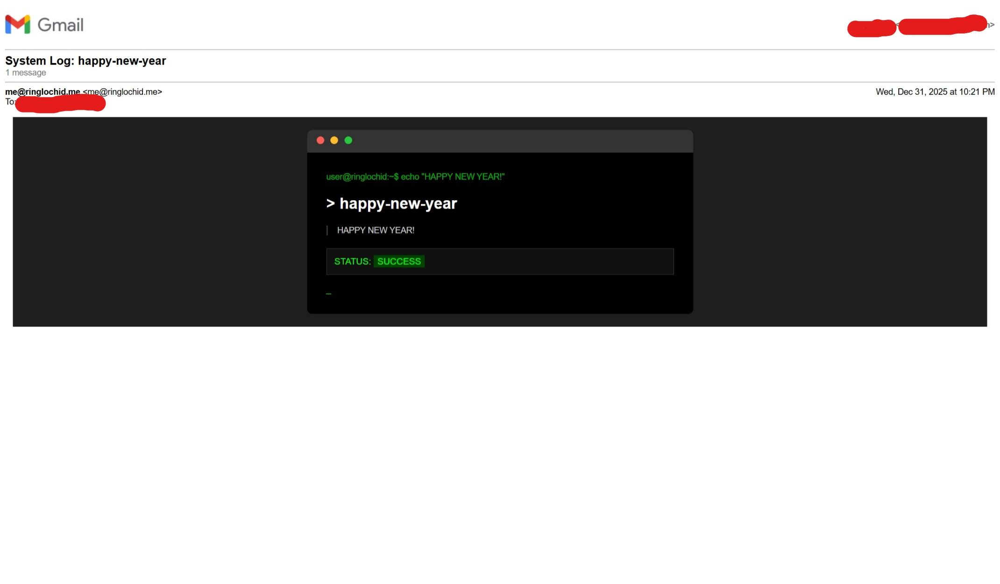
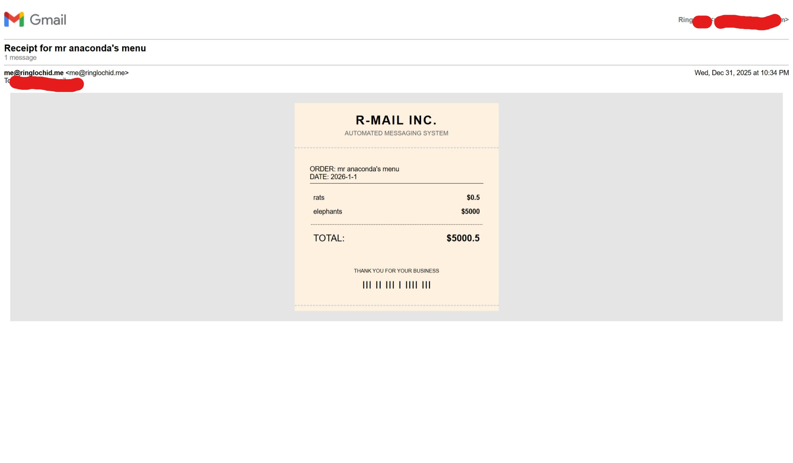
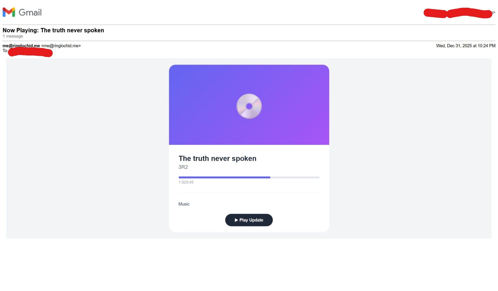

# 📘 r-mail User Guide

Welcome to the **r-mail** manual. This guide covers the complete workflow from creating smart templates to managing database contexts.

## 1. The Core Workflow
**r-mail** operates on a simple "Triangle of Data" principle:
1.  **The Template:** Defines the structure and *requests* variables.
2.  **The Context (Profile):** Provides *static* data (signatures, company info) automatically from the DB.
3.  **The Prompt:** Asks you interactively for any data that is still missing.

```text
[ Template (YAML) ]
       |
       v
[ Database Context ] + [ Interactive Input ]
       |
       v
[ Final Email Render ]
```

---

## 2. Anatomy of a Template
Templates live in your configured templates directory. They can be `.md` (Markdown) or `.html` (Raw HTML).

Every template **must** start with a YAML Frontmatter block.

### The Structure
```yaml
---
subject: "Welcome {{ user_name }}!"     <-- Logic: Jinja is allowed here!
variables:                              <-- Logic: Define prompts here
  user_name: "The recipient's name"     <-- Key: Variable Name | Value: Prompt Text
  promo_code: "Discount code"
---
# Hello {{ user_name }}

Here is your code: **{{ promo_code }}**
```

### Rules
1.  **Variable Names:** Must use **underscores** (`user_name`), NOT hyphens (`user-name`). Hyphens are treated as minus signs in math.
2.  **Subject Line:** You can use variables in the subject line. They will be rendered *after* the prompt collects the data.
3.  **HTML vs Markdown:**
    * Use **Markdown (`.md`)** for simple text emails.
    * Use **HTML (`.html`)** for complex layouts (grids, invoices, colors). *Note: Gmail requires table-based layouts; Flexbox does not work.*

---

## 3. Managing Context Profiles
"Contexts" are saved profiles in your database containing JSON data. They are useful for data you reuse often, like your signature or API keys.

**Example: Creating a "Work" Profile**
```bash
# 1. Create the context
r-mail context add work --description "My Config"

# 2. Edit the data (Opens in Vim)
r-mail context edit work
```
*Inside Vim:*
```json
{
  "company_name": "OpenShelves Inc.",
  "website": "[https://openshelves.app](https://openshelves.app)",
  "footer_logo": "[https://example.com/logo.png](https://example.com/logo.png)"
}
```

**Using it:**
```bash
# The -C flag merges this data into your template
r-mail send ... -C work
```

---

## 4. Template Gallery & Examples

Here are three advanced templates demonstrating what `r-mail` can do.

### A. The Terminal 📟
*Simulates a CLI window. Good for system logs or dev updates.*



**File:** `terminal.html`
```yaml
---
subject: "System Log: {{ log_title }}"
variables:
  log_title: "Process Name"
  status: "SUCCESS"
  message: "Main log output"
  command: "Command executed"
---
<!DOCTYPE html>
<html>
...
```

### B. The Receipt 🧾
*A monospaced invoice style with jagged edges.*



**File:** `receipt.html`
```yaml
---
subject: "Receipt for {{ project }}"
variables:
  project: "Project Name"
  date: "2026-01-01"
  item_1: "First Item"
  price_1: "$10.00"
  total: "$10.00"
---
...
```

### C. The Music Player 🎧
*A 'Now Playing' card with a progress bar.*



**File:** `player.html`
```yaml
---
subject: "Now Playing: {{ track_name }}"
variables:
  track_name: "Update Title"
  artist: "Your Name"
  lyrics: "Update body text"
---
...
```

---

## 5. Cheat Sheet

| Action | Command |
| :--- | :--- |
| **Send Email** | `r-mail send -f <alias> -t <email> -p <template>` |
| **List Templates** | `r-mail template list` |
| **Edit Template** | `r-mail template edit <name>` |
| **Create Profile** | `r-mail context add <name>` |
| **Edit Profile** | `r-mail context edit <name>` |
| **Debug Mode** | *Set up a local SMTP server on port 1025* |

```markdown
### 💡 Pro Tip: Testing Locally
Don't spam real people while designing templates. Run a local fake server:

1. **Open a new terminal:**
   `python3 -m aiosmtpd -n -l localhost:1025`

2. **Configure r-mail:**
   `r-mail domain add --name local --host localhost --port 1025 --security NONE`

3. **Send:**
   `r-mail send ... --domain local`

### Tip: query params for list commands:

- query: fuzzy match
- --limit
- --offset
```
